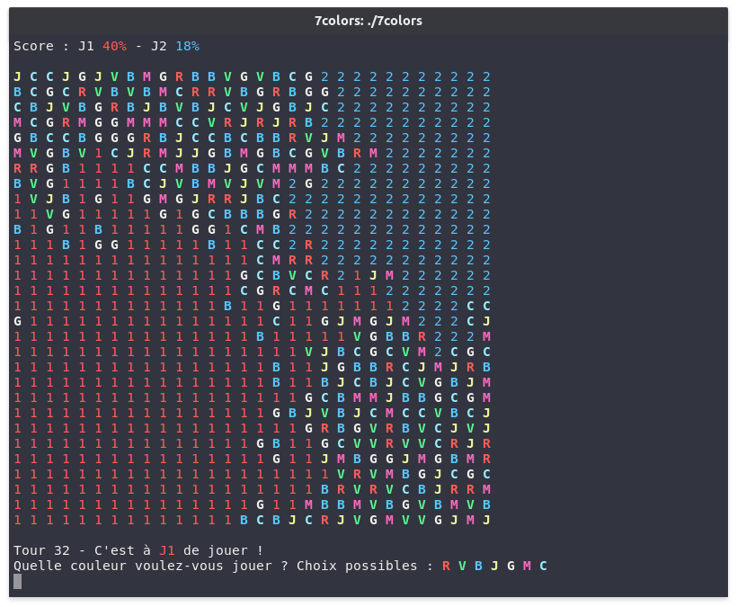

# 7colors
An implementation of the 7 colors game written in C.

## Project structure
* `defaults.c` contains all the defaults values
* `structures.c` contains all the structures used in the projects : player, strategy, linked list, queue...
* `utils.c` contains basic functions such as reading or writing a cell, choosing a random color...
* `display.c` contains functions for printing the board, the score and the results of a game
* `input.c` contains functions for asking game modes, next move and new game
* `board.c` contains functions for creating the board and updating it after each move
* `strategies.c` contains different strategies for artificial intelligence
* `game.c` contains functions for selecting strategies and running normal or fast games
* `main.c` contains the main loop of the game

## Done
* generate the board
* naive search of accessible colors
* list and queue structure
* correctly handling colors
* better propagation function
* 2 players mode
* better update function using BFS
* single player mode with random player
* mode selection screen
* generic function for running a game
* greedy artificial intelligence
* hegemonic artificial intelligence
* tournament mode with statistics
* abstract structures to replace globals

## Todo
* __write tests__
* write documentation
* write a detailed report
* improve artificial intelligence (minimax ?)

## Sources
* http://www.gecif.net/qcm/information/ascii_decimal_hexa.pdf
* http://web.theurbanpenguin.com/adding-color-to-your-output-from-c/
* https://en.wikipedia.org/wiki/Minimax
* https://en.wikipedia.org/wiki/Alpha%E2%80%93beta_pruning
